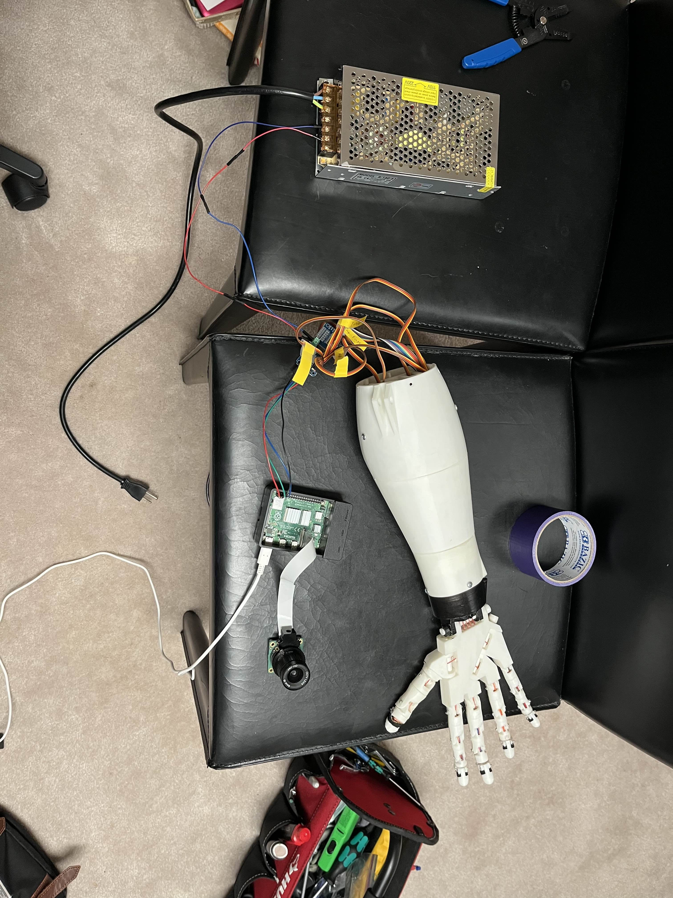

# FPGA Bionic Robot Hand

## Overview

This project implements a fully 3D-printed robotic hand controlled by an FPGA (DE1-SoC) using Verilog. The system decodes microcoded gesture instructions and sends PWM signals to five servo motors that control finger movement. Unlike conventional microcontroller-based control, this setup demonstrates how low-level digital logic and hardware description languages can directly control physical systems, a strong demonstration of computer architecture and embedded design.

## Video

**TODO:** Put video here

## Hardware Components

- **DE1-SoC FPGA Development Board**: Acts as the main controller, generating PWM signals in Verilog for each servo motor based on microcoded instruction decoding.
- **5V 30A 150W Power Supply**: Provides regulated power directly to all five servo motors to prevent brownouts and overheating during high torque loads.
- **HK-15298 Servo Motors**: Five servo motors drive the fingers of the robotic hand. (An additional wrist motor is included in hardware but unused in this prototype.)
- **Custom 3D-Printed Hand & Mechanical Claw**: Designed based on the InMoov open-source hand project.
- **PCA9685 Driver (Optional)**: Previously used with Raspberry Pi for testing, now bypassed in final FPGA-controlled version.

## Circuit Diagram (with Raspberry Pi testing)

## Final Wiring (FPGA-Controlled Version)

**TODO:** Put new diagram here

## Demonstration

### Images

### 🛠️ For more images and videos of the project's development and my debugging story with hardware/software 🤯, [click here!](images/README.md).

Special thanks to the members of the [InMoov Discord Server](https://discord.gg/FKJ6GSEwHr) for their invaluable guidance and support throughout the project. Especially to hairygael, the admin of the server and the creator of the InMoov project.

This project is licensed under the MIT License. See the LICENSE file for details.
