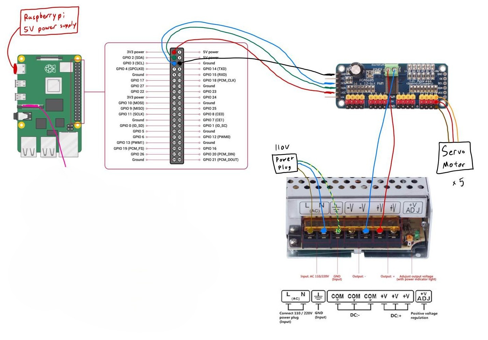

# FPGA Bionic Robot Hand

## Overview

This project implements a fully 3D-printed robotic hand controlled by an FPGA (DE1-SoC) using Verilog. The system decodes microcoded gesture instructions and sends PWM signals to five servo motors that control finger movement. Unlike conventional microcontroller-based control, this setup demonstrates how low-level digital logic and hardware description languages can directly control physical systems, a strong demonstration of computer architecture and embedded design.

## Video

**TODO:** Put video here

## Hardware Components

- **DE1-SoC FPGA Development Board (Cyclone V Soc Altera)**: Acts as the main controller, generating PWM signals in Verilog for each servo motor based on microcoded instruction decoding.
- **[5V 30A 150W Power Supply](https://www.amazon.ca/gp/product/B07Q2VPPL1/ref=ox_sc_act_title_1?smid=A30R8HAL0CY1G4)**: Provides regulated power directly to all five servo motors to prevent brownouts and overheating during high torque loads.
- **[HK-15298 Servo Motors](https://hobbyking.com/en_us/hobbykingtm-hk15298-high-voltage-coreless-digital-servo-mg-bb-15kg-0-11sec-66g.html)**: Five servo motors drive the fingers of the robotic hand. (An additional wrist motor is included in hardware but unused in this prototype)
- **[3D-Printed Robotic Hand](https://inmoov.fr/hand-i2/)**: Designed based on the InMoov open-source hand project.
- **[PCA9685 Driver (Used for testing)](https://www.amazon.ca/Newhail-PCA9685-Channel-Arduino-Raspberry/dp/B08YD8PDLS?crid=1EMZCJTIOY1GQ)**: Previously used with Raspberry Pi for testing, now bypassed in final FPGA-controlled version.
- **Raspberry Pi 4 (Used for testing)**: Used during development for I2C control and quick prototyping before transitioning to the FPGA system.

## Final Wiring

## Demonstration (Story & Images & Videos)

  
Building the Robot Arm

  A lot of this was following InMoov Hand I2 Tutorial with some small modifications. A lot of 3D printing and assembling. Had to even buy soldering kit to solder the finger tips which I ended up not using. Having so much hot glue on my fingers and the strings getting messed up inside the arm was such a pain.

  

    
    
    
    
    
    
    
    
   
   
  

  
Testing Arm with Raspberry Pi and PCA9685 Driver

  Most of the challenges was powering the robot arm itself since that wasn't documented within the website, I had to find my own way of powering this thing. 

  I first tried powering the servo motors with just bare breadboard with 5V battery and it wouldn't even move. (When I tested with a smaller version it worked fine)

  So I thought I needed more power so I bought lithium ion batteries but found that these are pretty dangerous. (Check 1st Picture) I didn't understand the cable out of it too. I ended up just returning this.

  After reading the specification with this servo, I needed more current, specifically 5V 20A 100W. I got a Converter Adapter that matches exactly what I needed. 

  The next steps was just to create python scripts on Raspberry Pi I had sitting at home to test the servo motors. This was so much easier to do.

  

    
    
    
    
    
    <a href="https://youtu.be/FcC7a2nn-p4">Watch the testing video here</a>
  

  
Robot Arm with FPGA Integration

  After testing with my Raspberry Pi, I can now finally integrate my FPGA DE1-SOC into this project knowing the robot arm actually moves.

  It took me quite long to find how my DE1-SOC (Cyclone V Soc Altera) GPIO Pins work, I ended up finding it in [Cornell University ECE Course](https://people.ece.cornell.edu/land/courses/ece5760/). 

  After testing the robot arm actually moves with FPGA using Quartus, I started working on the actual design how I would integrate this with a FIFO. 

  

    
  

---

  Special thanks to the members of the 
  <a href="https://discord.gg/FKJ6GSEwHr">InMoov Discord Server</a> 
  for their invaluable guidance and support throughout the build for Robot Arm. 
  Especially to hairygael, the admin of the server and the creator of the InMoov project.

  This project is licensed under the MIT License. See the LICENSE file for details.

